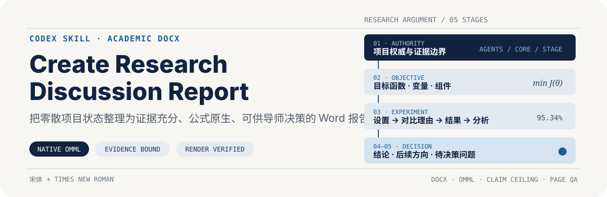

<p align="center">
  
</p>

把具体的方法设计、代码实现、实验结果、图表和已有文稿整理成一份自然、简洁、可直接与导师或同领域研究者讨论的中文学术报告。

它不会强迫所有项目套用同一个章节结构。报告会根据项目处于方向探索、方法设计、阶段实验还是综合总结阶段，选择真正需要的内容，并沿一条清楚的研究叙事组织。

## 适合什么任务

- 项目初期或中期的研究方向讨论
- 方法设计与组件说明
- 阶段实验、对比实验和结果总结
- 组会或导师讨论 DOCX
- 公式较多、需要原生 Word 公式的研究报告
- 已有报告内容零散、英文术语过多或工程细节干扰阅读的重构

## 默认写作方式

| 要求 | 默认处理 |
| --- | --- |
| 内容组织 | 根据当前问题和材料动态组织，不固定章节顺序 |
| 面向读者 | 写成自然的中文研究讨论，而不是项目日志 |
| 方法深度 | 默认说明目标、输入输出和组件作用；只有需要时才展开完整流程 |
| 术语 | 中文优先；必要缩写或精确代码身份只在首次出现时说明 |
| 数学公式 | 使用可编辑的 Word 原生 OMML |
| 实验结果 | 优先用紧凑表格和平均值 ± 标准差，展示用户关心的指标 |
| 负面结果 | 与相应正面发现放在一起解释，不隐藏也不反复强调 |
| 不确定展示 | 只有会实质改变篇幅或重点时才请用户决定 |

## 灵活的内容块

报告可以从以下内容中选取需要的部分：

- 研究问题或当前方向
- 目标函数与方法组件
- 设计选择及备选方案
- 实验协议
- 对比方法及采用理由
- 初步、诊断、主实验、消融、敏感性或失败结果
- 结果分析与当前认识
- 真正需要导师决定的问题

这些内容块没有固定顺序，也不是每份报告都必须出现。方向探索阶段的诊断实验可以直接放在它所回答的问题之后；结果型报告则可以快速进入协议、对比方法和表格。

## 人类可读性

- 不默认加入“证据来源”章节。
- 不把 Git SHA、仓库路径、哈希、内部状态或运行日志写进正文。
- `baseline`、`fit`、`runner`、`checkpoint`、`quota` 等词优先改写为自然中文。
- `Q_submit`、OLS、TSK、NMI 等必须保持身份或已广泛使用的标识可以保留。
- 不为显得完整而加入固定数量的后续问题、限制声明或空泛建议。

## 为什么不是普通的 Word 改写

- **以真实材料为基础。** 从实际设计、代码和实验结果提炼内容，不依赖聊天印象补全事实。
- **按讨论目的控制深度。** 方法概览、组件比较和完整算法说明使用不同的详细程度。
- **结果优先。** 用紧凑表格呈现最能回答当前问题的指标，不堆积完整逐次运行明细。
- **公式可继续编辑。** OMML 公式不是图片，也不是普通 Unicode 文本。
- **交付前检查实际页面。** 生成后检查公式、字体、表格、分页和页面布局。

## 安装

### Windows PowerShell

```powershell
git clone https://github.com/Dreiot/create-research-discussion-report.git `
  "$env:USERPROFILE\.codex\skills\create-research-discussion-report"
```

### macOS / Linux

```bash
git clone https://github.com/Dreiot/create-research-discussion-report.git \
  ~/.codex/skills/create-research-discussion-report
```

重新启动或刷新 Codex 后即可调用。

## 使用示例

```text
使用 $create-research-discussion-report，把当前方法设计和实验结果整理成一份
面向导师的中文进展报告。结构根据现有材料自然组织，术语中文优先，公式使用
Word 原生公式，结果用平均值 ± 标准差汇总。
```

如果具体展示方式会显著改变报告重点，可以直接说明，例如：

```text
方法只介绍目标函数和组件，不展开优化过程；只展示 NMI 和 ACC；原文件允许覆盖。
```

## DOCX 验证

skill 附带结构和可读性检查器：

```bash
python scripts/validate_docx_report.py /path/to/report.docx
```

它检查字体、OMML、表格分页保护、百分比格式，以及正文中是否意外出现仓库路径、Git 身份或内部状态。最终交付仍需经过 Word 或可靠 DOCX 渲染器的逐页视觉检查。

## 文件结构

```text
create-research-discussion-report/
├── SKILL.md
├── agents/openai.yaml
├── references/
│   ├── human-writing-style.md
│   ├── source-grounding.md
│   ├── method-workflow.md
│   ├── math-and-results-style.md
│   └── report-structure.md
├── scripts/validate_docx_report.py
└── assets/readme/hero.svg
```

## 边界

- 默认不运行新实验、不访问受保护数据，也不改变项目方法。
- 不把初步或混合结果写成稳定优势。
- 不把单一数据集、单一指标或缺失统计扩展为更强结论。
- 对外发布前仍应人工检查作者信息、隐私和未公开内容。

## License

[MIT](./LICENSE)
